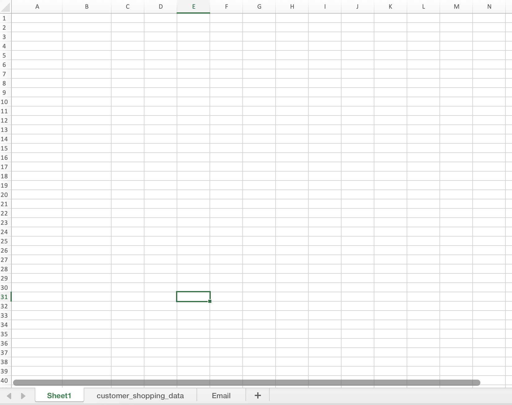

# Automatic-sales-report
Hi, this is Linh's project named Automatic Sales Report. 

Programming Language: VBA

Dataset from Kaggle: https://www.kaggle.com/datasets/mehmettahiraslan/customer-shopping-dataset 

I. Business Context
With the macros, time-consuming and error-prone tasks like data entry, formatting, and analysis can be performed quickly and accurately, freeing up secretaries to focus on more complex and important work.
II. Overall Goal
- Save time and money for organizations
- Allow employees to focus on higher-level tasks that require creativity, critical thinking, and interpersonal skills.
III. Repetitive Task List
1. Sorting: Dataset cleanup and readiness
2. Chart: Creating data visualization
3. Promotion: Discount % and Conditional Formatting 
4. Save as PDF: Save Customer Shopping Report
5. Email: Email PDF to Managers

Let's see the magic!

1. Sorting: sort the transactions that each customer spent in descending value.

Before:

After:

2. Chart: leverage Pivot Table in Excel to calculate sum of quantity purchased by category, then create a bar chart for data visualization purpose. 

Before:

After:

3. Promotion: decide discount percentage based on quantity purchased, then use conditional formatting to color the discount percentage (green: 5%; yellow: 2%; red: 0%).

Before:

After:

4. Save as PDF: save the workbook into PDF file.

Result:

5. Email: Send the PDF to stakeholders via email.

Email list:

Sent PDF file in Microsoft Outlook:

